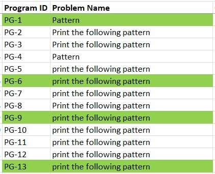

# Instructions

Please follow the mentioned instructions while editing the excel sheet

- Always make the edit as an outlook user. Not as a guest. Means, please make sure you logged in using your technicalhub mail to edit this sheet.

 

- Search the problem you edited or wish to edit by the name of the problem.  
**Note:** If you wish to change the name of the problem itself keep track of it's old name to search in this sheet. And also update the new name you given to the problem in *Problem Name* field.

 

- Turn the cells *Program ID* and *Problem Name* to *green color* **after successful completion of the edit to the description part of the program**.  
    
  **Note:** Refer the following document to edit the description part as per template.

 

- If you write a working code for the problem in any proramming language (C, C++, Java, Python). Make sure you add your employee ID and Name in the following manner
**EmployeeID (Name)** as Author under appropriate field in the sheet. Also highlight the cell in green color to idenity that the code's been added recenly through refinement process.
    
  *Indicates Code (In C Language) has been added through refinement by B. Pavan*

 

- Finally insert the date under *Modified On* field on the date you modified the description of program.  
  **Tip:** Just press Ctrl+; to insert current day's date in excel.
